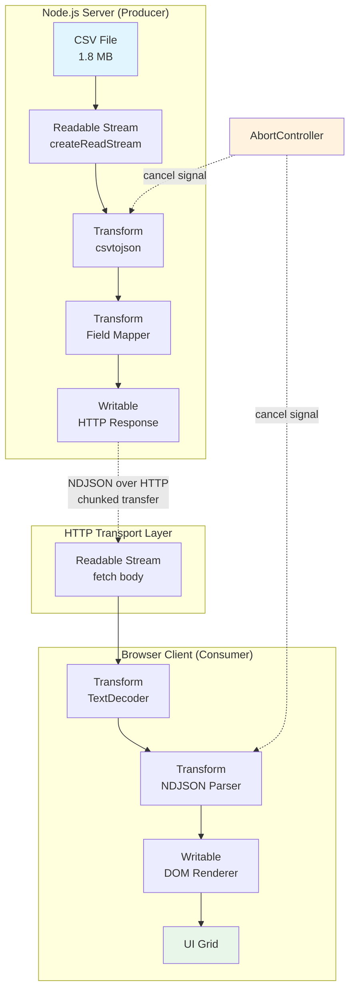
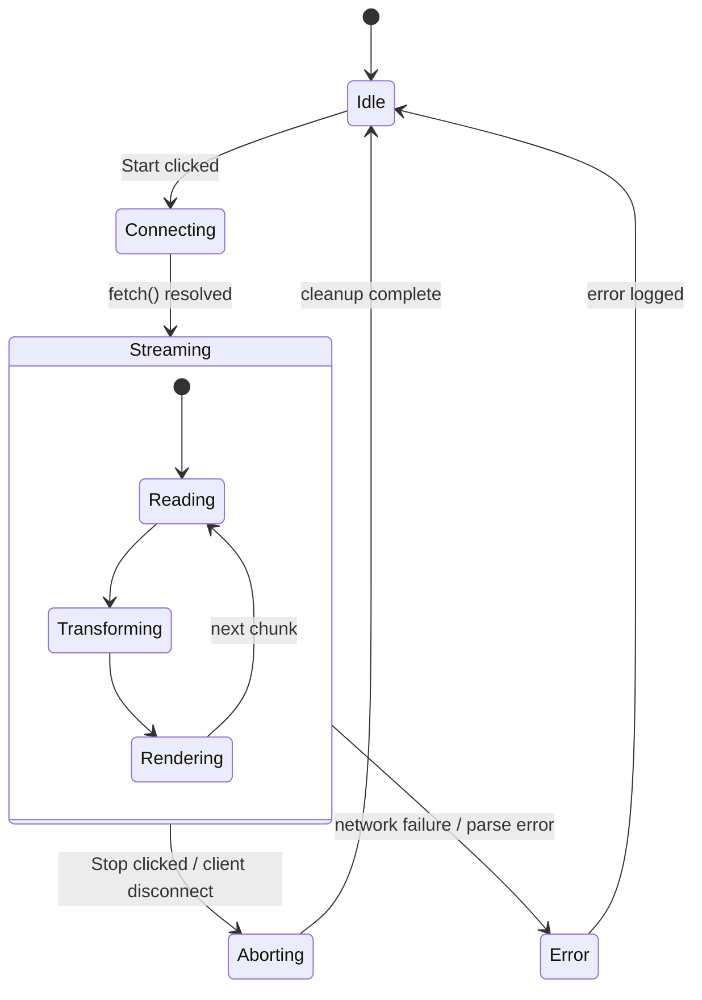

# Architecture Deep Dive

> System design analysis of the handle_infinity_GB_of_data streaming architecture

---

## Table of Contents

- [1. Architectural Overview](#1-architectural-overview)
- [2. Component Architecture](#2-component-architecture)
- [3. Data Flow Analysis](#3-data-flow-analysis)
- [4. Stream Pipeline Architecture](#4-stream-pipeline-architecture)
- [5. Backpressure Mechanisms](#5-backpressure-mechanisms)
- [6. Connection Lifecycle](#6-connection-lifecycle)
- [7. Error Handling Strategy](#7-error-handling-strategy)
- [8. Scalability Patterns](#8-scalability-patterns)
- [9. Technology Decisions & Rationale](#9-technology-decisions--rationale)
- [10. Trade-off Analysis](#10-trade-off-analysis)

---

## 1. Architectural Overview

### Architectural Style: **Streaming Pipeline (Pipe-and-Filter)**

The system implements a **unidirectional data-flow architecture** where data moves through a chain of processing stages connected by streams. Each stage (filter) performs a single transformation and passes data downstream (pipe).



### Key Architectural Qualities

| Quality Attribute | Realization | Assessment |
|-------------------|-------------|------------|
| **Scalability** | Streaming = constant memory per connection | ✅ Excellent |
| **Resilience** | AbortController + try/catch at boundaries | ⚠️ Partial |
| **Performance** | Lazy evaluation, no buffering | ✅ Excellent |
| **Maintainability** | Single files, functional style | ⚠️ Demo-grade |
| **Testability** | No test seams, no DI | ❌ Poor |
| **Observability** | console.log only | ❌ Poor |

---

## 2. Component Architecture

### 2.1 Server Component (Producer)

**Responsibility:** Read CSV from disk, transform to NDJSON, stream over HTTP.

```
┌─────────────────────────────────────────────────────┐
│                  HTTP Server                         │
│              (node:http, port 3000)                  │
├─────────────────────────────────────────────────────┤
│                                                      │
│   Request Handler                                    │
│   ┌──────────────────────────────────────────┐      │
│   │ 1. CORS preflight (OPTIONS → 204)        │      │
│   │ 2. fs.stat() → file size log             │      │
│   │ 3. Register close listener → abort       │      │
│   │ 4. Build pipeline → pipeTo(response)     │      │
│   └──────────────────────────────────────────┘      │
│                                                      │
│   Stream Pipeline                                    │
│   ┌──────────┐   ┌───────────┐   ┌───────────┐      │
│   │ Source   │──▶│ Transform │──▶│ Transform │──┐   │
│   │ CSV File │   │ csvtojson │   │ Mapper    │  │   │
│   └──────────┘   └───────────┘   └───────────┘  │   │
│                                                  ▼   │
│                                         ┌───────────┐│
│                                         │  Sink     ││
│                                         │ HTTP Resp ││
│                                         └───────────┘│
└─────────────────────────────────────────────────────┘
```

**Component Inventory:**

| Component | Type | Implementation | Responsibility |
|-----------|------|----------------|----------------|
| File Source | Readable | `createReadStream()` | Byte-level file reading |
| CSV Parser | Transform | `csvtojson()` | CSV rows → JSON objects |
| Field Mapper | Transform | `TransformStream` | Select/rename fields |
| HTTP Sink | Writable | `Writable.toWeb(response)` | Network transmission |
| Lifecycle Mgr | Controller | `AbortController` | Cancellation propagation |

### 2.2 Client Component (Consumer)

**Responsibility:** Fetch stream, parse NDJSON, render incrementally.

```
┌─────────────────────────────────────────────────────┐
│                  Browser (SPA)                       │
├─────────────────────────────────────────────────────┤
│                                                      │
│   UI Layer (index.html)                              │
│   ┌─────────────┐  ┌─────────────┐  ┌───────────┐   │
│   │ Start Btn   │  │ Stop Btn    │  │ Card Grid │   │
│   └──────┬──────┘  └──────┬──────┘  └─────▲─────┘   │
│          │                │               │         │
│          ▼                ▼               │         │
│   ┌──────────────────────────────────┐    │         │
│   │     Controller (index.js)        │    │         │
│   │  AbortController lifecycle       │    │         │
│   └──────────────┬───────────────────┘    │         │
│                  │                         │         │
│   Stream Pipeline│                         │         │
│   ┌──────────┐   ▼  ┌───────────┐   ┌─────┴─────┐   │
│   │ fetch()  │────▶│ TextDecoder│──▶│ NDJSON    │   │
│   │ body     │      │           │   │ Parser    │   │
│   └──────────┘      └───────────┘   └─────┬─────┘   │
│                                           │         │
│                                     ┌─────▼─────┐   │
│                                     │ DOM       │   │
│                                     │ Renderer  │──▶│──┐
│                                     └───────────┘   │  │
└─────────────────────────────────────────────────────┘  │
                                                        ▼
                                                  [User View]
```

---

## 3. Data Flow Analysis

### 3.1 End-to-End Transformation Chain

| Stage | Format | Example | Transformation |
|-------|--------|---------|----------------|
| 1. Disk | CSV bytes | `title,description,...\n"DBZ","Goku..."` | — |
| 2. ReadStream | Buffer chunks | `<Buffer 74 69 74...>` | File → memory |
| 3. csvtojson | Buffer (JSON lines) | `{"title":"DBZ",...}` | CSV → JSON |
| 4. Mapper | String (NDJSON) | `{"title":"DBZ",...}\n` | Filter fields + newline |
| 5. HTTP | Byte chunks | Transfer-Encoding: chunked | Serialize |
| 6. fetch | Uint8Array | `[123, 34, 116...]` | Network receive |
| 7. TextDecoder | String | `{"title":"DBZ"...}\n{"title"...` | Bytes → UTF-8 |
| 8. NDJSON Parser | Object | `{title: "DBZ", ...}` | Split + JSON.parse |
| 9. DOM Renderer | HTML string | `<article>...</article>` | Template → DOM |

### 3.2 Critical Data Flow Observation

> ⚠️ **Chunk Boundary Problem**: TCP/HTTP chunks do NOT align with NDJSON line boundaries. The client parser (as implemented) fails when a JSON object is split across two chunks:

```
Chunk 1:  {"title": "Dragon Ba
Chunk 2:  ll Z", "description": ...}\n
```

**Proper solution** (not implemented, acknowledged in code comments):
```javascript
class LineBuffer {
  constructor() { this.buffer = ''; }
  
  push(chunk) {
    this.buffer += chunk;
    const lines = this.buffer.split('\n');
    this.buffer = lines.pop(); // Keep incomplete line
    return lines.filter(Boolean);
  }
}
```

---

## 4. Stream Pipeline Architecture

### 4.1 Server Pipeline Composition

```javascript
// server/index.js — Full pipeline
await Readable.toWeb(createReadStream(filename))     // ① Source
  .pipeThrough(                                       // ② Node Transform
    Transform.toWeb(csvtojson({ 
      headers: ["title", "description", "url_anime"] 
    }))
  )
  .pipeThrough(                                       // ③ Web Transform
    new TransformStream({
      async transform(jsonLine, controller) {
        const data = JSON.parse(Buffer.from(jsonLine));
        controller.enqueue(
          JSON.stringify({ /* mapped fields */ }).concat("\n")
        );
      }
    })
  )
  .pipeTo(                                            // ④ Sink
    Writable.toWeb(response),
    { signal: abortController.signal }
  );
```

**Pipeline Pattern: Node → Web → Web → Web → Node**

### 4.2 Client Pipeline Composition

```javascript
// app/index.js — Full pipeline
const response = await fetch(API_URL, { signal });   // ① Source
const reader = response.body
  .pipeThrough(new TextDecoderStream())              // ② Decode
  .pipeThrough(parseNDJSON());                       // ③ Parse

await reader.pipeTo(                                 // ④ Sink
  appendToHtml(cards),
  { signal: abortController.signal }
);
```

### 4.3 Design Pattern: **Chain of Responsibility + Iterator**

The pipeline is essentially a **lazy iterator chain** with automatic flow control. Each stage:
- Pulls data only when ready (backpressure)
- Transforms without materializing the full collection
- Propagates cancellation upstream

---

## 5. Backpressure Mechanisms

### 5.1 What is Backpressure?

**Backpressure** = flow control signal from slow consumer to fast producer, preventing memory overflow.

```
Fast Producer ──► [QUEUE] ──► Slow Consumer
                     ▲
                     │ "Slow down!"
                     │
              High Water Mark reached
```

### 5.2 Automatic Backpressure in Web Streams

Web Streams implement backpressure **automatically** through the `pipeTo`/`pipeThrough` chain:

| Mechanism | Behavior |
|-----------|----------|
| Internal queue | Each stream has configurable queue (default size 1) |
| `desiredSize` | Readable stream checks writable's capacity before enqueueing |
| Transform pausing | `transform()` return value is awaited before next chunk |
| Write acknowledgment | `write()` returns Promise resolved when queue has space |

### 5.3 Backpressure in This Project

```
Server:
  File Read ──► csvtojson ──► Mapper ──► HTTP Response
     ▲                                       │
     └──────── network slow ◄────────────────┘
     (response.write() blocks → propagates back to file read)

Client:
  fetch body ──► Decoder ──► Parser ──► DOM Writer
     ▲                                         │
     └────── sleep(1000) simulates slow sink ──┘
```

### 5.4 Demonstrated Pattern: Artificial Backpressure

The client deliberately simulates a slow consumer:

```javascript
new WritableStream({
  write(data) {
    sleep(1000).then(() => element.innerHTML += card);
    // Note: this is fire-and-forget, does NOT create proper backpressure.
    // Proper implementation:
    // return sleep(1000).then(() => element.innerHTML += card);
  }
});
```

> ⚠️ **Architectural Note**: The current implementation breaks backpressure by not returning the promise from `write()`. This is demo-intentional but should be flagged.

---

## 6. Connection Lifecycle

### 6.1 State Machine



### 6.2 Server-Side Lifecycle

```javascript
createServer(async (request, response) => {
  const abortController = new AbortController();
  
  // Disconnect detection
  request.once("close", () => {
    abortController.abort();           // ← Signal propagation
    console.log("Connection closed");
  });
  
  await pipeline
    .pipeTo(Writable.toWeb(response), { 
      signal: abortController.signal    // ← Cancellation binding
    });
});
```

**Lifecycle events:**

| Event | Trigger | Server Action | Client Action |
|-------|---------|---------------|---------------|
| `connect` | HTTP GET | Open file stream | — |
| `stream` | Pipeline ready | Push NDJSON chunks | Parse + render |
| `abort` | Client disconnect | Abort file read | — |
| `error` | Parse/IO failure | Log, close response | Log, throw |
| `close` | EOF or abort | Cleanup | Cleanup |

---

## 7. Error Handling Strategy

### 7.1 Error Taxonomy

```
Errors
├── Transient (recoverable)
│   ├── Network blip
│   ├── Partial chunk (NDJSON split)
│   └── Client abort (intentional)
├── Permanent (fatal)
│   ├── File not found
│   ├── Disk read error
│   └── Malformed CSV (entire file)
└── Data-level (skippable)
    ├── Malformed row
    └── Missing fields
```

### 7.2 Current Error Handling

| Layer | Mechanism | Coverage |
|-------|-----------|----------|
| Server HTTP | `try/catch` around pipeline | ✅ Network + file errors |
| Server abort | `error.message.includes("abort")` | ✅ Intentional aborts |
| Client fetch | `try/catch` + abort filter | ✅ Abort errors |
| Client parse | `controller.error(error)` | ❌ Kills entire stream |
| NDJSON split | **None — commented only** | ❌ Known bug |

### 7.3 Gap Analysis

| Gap | Impact | Recommended Fix |
|-----|--------|-----------------|
| Split NDJSON chunks crash parser | Stream aborts mid-transfer | Line buffer in TransformStream |
| Single bad row kills stream | No fault isolation | Skip row + log, continue |
| No retry logic | Transient failures fatal | Exponential backoff client-side |
| No dead letter queue | Bad data lost | Route to error stream |

---

## 8. Scalability Patterns

### 8.1 Vertical Scalability

**Memory profile per connection (constant):**

```
Memory = O(chunk_size) 
       ≈ 64 KB (default high water mark)
       + parser internal state
       ≈ < 5 MB total per connection
```

**CPU profile:**
- CSV parsing: O(n) single pass
- JSON serialization: O(n) per record
- No sorting, no aggregation → no O(n log n) traps

### 8.2 Horizontal Scalability Path

```
                    ┌──► Server Instance 1 ──► ...
                   /
            ┌──────┤
  Clients ──┤  LB   ├──► Server Instance 2 ──► ...
  (many)    │       │
            └──────┤
                   \
                    └──► Server Instance N ──► ...
```

**Requirements for horizontal scaling:**
- ✅ Server is **stateless** (no session storage) — ready
- ⚠️ File must be shared (NFS, S3) or replicated
- ⚠️ Need health checks + graceful drain
- ⚠️ Load balancer must support long-lived connections (no aggressive timeouts)

### 8.3 Beyond: True "Infinite" Data

To handle truly unbounded streams, swap the source:

```javascript
// Instead of file, use unbounded source:
const sources = {
  file: () => createReadStream('animeflv.csv'),
  database: () => db.query('SELECT * FROM anime').stream(),
  kafka: () => kafkaConsumer.stream('anime-topic'),
  generator: () => (async function*() { 
    while(true) yield generateRecord(); 
  })()
};
```

All downstream pipeline stages remain **unchanged** — the power of stream abstraction.

---

## 9. Technology Decisions & Rationale

### 9.1 Decision Matrix

| Decision | Options Considered | Chosen | Rationale |
|----------|-------------------|--------|-----------|
| Stream API | Node streams / Web streams / Both | Both + interop | Demonstrates isomorphic capability |
| CSV Parser | papaparse / csv-parser / csvtojson | csvtojson | Transform stream interface, header mapping |
| Wire Format | JSON array / NDJSON / SSE / Protobuf | NDJSON | Line-oriented, stream-friendly, debuggable |
| Transport | HTTP / WebSocket / HTTP2-push | HTTP chunked | Simplest for demo, ubiquitous |
| Server Framework | Express / Fastify / raw http | Raw `node:http` | Zero framework overhead, educational |
| Client Framework | React / Vue / vanilla | Vanilla JS | Focus on streams, not framework |
| Dev Server | Vite / webpack / browser-sync | browser-sync | Minimal config for static files |

### 9.2 Why Web Streams Over Pure Node Streams?

| Aspect | Node Streams | Web Streams |
|--------|-------------|-------------|
| Browser support | ❌ (needs polyfill) | ✅ Native |
| Async iteration | ✅ | ✅ |
| Backpressure | ✅ | ✅ |
| Standardization | Node-specific | **WHATWG standard** |
| Isomorphic code | ❌ | ✅ (Node 18+) |

**Winner: Web Streams** — write once, run server + browser.

---

## 10. Trade-off Analysis

### 10.1 Current Design Trade-offs

| Chose | Over | Gained | Lost |
|-------|------|--------|------|
| Simplicity | Robustness | Easy to learn | Production-readiness |
| Streaming | Buffering | Memory efficiency | Random access to data |
| Push (pipeTo) | Pull (for-await) | Backpressure auto | Fine-grained control |
| NDJSON | JSON array | Incremental parsing | Schema-less validation |
| innerHTML | DOM API | Demo brevity | XSS vulnerability |
| Single module | Layered modules | Minimal ceremony | Testability, DI |

### 10.2 Evolution Path

```
Current (Demo)
    │
    ├──▶ Add line buffer         ──▶ Robust parser
    ├──▶ DOM API rendering       ──▶ Security
    ├──▶ Schema validation       ──▶ Data integrity
    ├──▶ Dataloaders / batching  ──▶ Performance
    ├──▶ Observability stack     ──▶ Production ops
    └──▶ Test coverage           ──▶ Maintainable

Future (Production)
```

---

## Appendix A: ADR Template for Future Decisions

```markdown
# ADR-NNNN: [Title]
- Status: [Proposed | Accepted | Deprecated]
- Context: [Forces at play]
- Decision: [What we decided]
- Consequences: [Positive / negative / risks]
- Alternatives considered: [What we rejected and why]
```

---

*Analysis by: @wilson-architect | Avanade Method | Phase 3: Solutioning*